## PROJECT: MPI.JS

<!-- You should write up your final project report in the style of a research paper. Please go into detail
regarding the analysis that you did throughout your project, including any initial approaches
that did not work well (and how you diagnosed and fixed their performance problems), etc. To
go into this amount of detail, a typical report might be roughly 10 pages long (double-spaced,
including figures), although that is just a ballpark estimate (we will not be counting pages).
While you have flexibility in how you structure you report, we suggest that you include the
following sections. (You are also encouraged to provide more detail if you wish.) Note that
some of the information in your final writeup can be pulled directly from your proposal if it is
still accurate. -->

## URL

[https://the-parallel-gods.github.io/mpi.js/home/](https://the-parallel-gods.github.io/mpi.js/home/)

## SUMMARY

<!-- SUMMARY: A short (no more than a paragraph) project summary. If applicable, the sum-
mary should list your project deliverables (including what you plan to show at the paral-
lelism competition) and what machines they ran on. Here are some examples:
* We implemented smooth particle hydrodynamics in CUDA on the GPU and in ISPC
on the CPU and compared the performance of the two implementations.
* We parallelized a chess bot. Our 64 core implementation on Bridges-2 achieves a 40x
speedup and won several games on an internet chess server.
* We accelerated image processing operations using the GPU. Given the speed
of our implementation, we demonstrate that a brute-force approach to breaking
CAPTCHAS is effective. -->

**We want to create an MPI library in the browser using JavaScript, implement some of the APIs (bcast, barrier, all\_reduce, ...), use them to run MPI programs, and optimize the MPI collective APIs given the browser environment.**

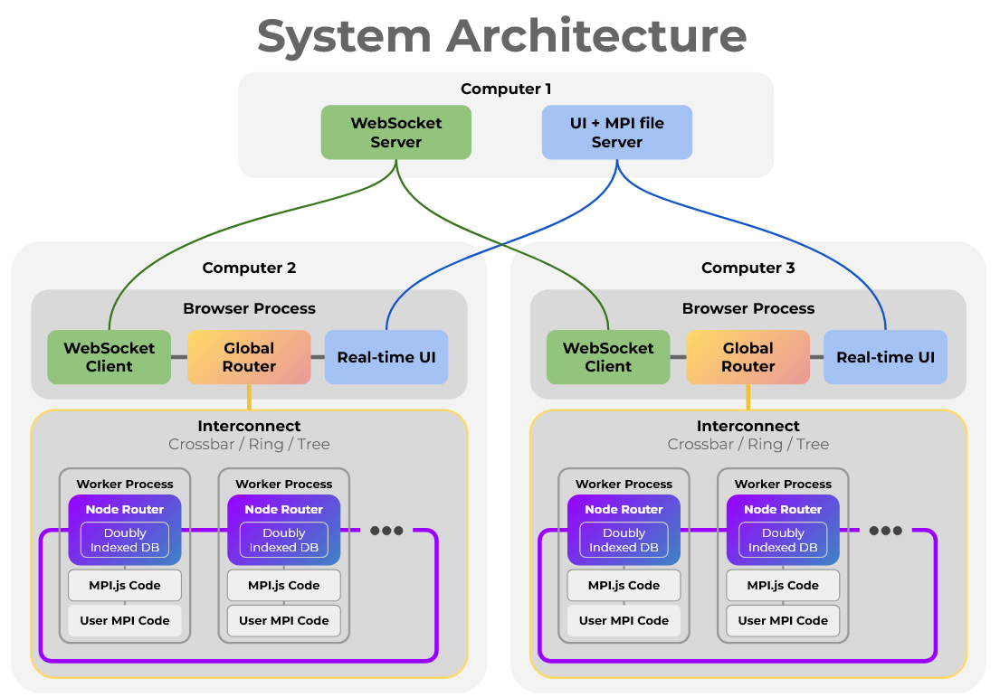

This project contains >3000 lines of code and documentation.

## BACKGROUND


<!-- BACKGROUND: Describe the algorithm, application, or system you parallelized in com-
puter science terms. Figures would be really useful here.
* What are the key data structures?
* What are the key operations on these data structures?
* What are the algorithm’s inputs and outputs?
* What is the part that computationally expensive and could benefit from paralleliza-
tion?
* Break down the workload. Where are the dependencies in the program? How much
parallelism is there? Is it data-parallel? Where is the locality? Is it amenable to
SIMD execution? -->

MPI has never been implemented in JavaScript in the browser before, so we are bound to run into many new interesting problems specific to the runtime environment. In this section, we provide some background information on how JavaScript works and describe the challenges it poses. In the next section, we will describe our approach to solving these challenges.

### Processes inside a browser are very isolated

For good security reasons, each process in the browser is very isolated from the others. This means that there is no shared memory between processes, and communication between processes is limited. The only types of communication that are allowed are point-to-point `MessageChannel`s and `BroadcastChannel`s. To make things worse, `BroadcastChannel`s are rate-limited one message per 100ms, which is too slow. Effectively, we are forced to use `MessageChannel`s for our communication inside a browser.

### JavaScript is event-driven single-threaded language

Normally, JavaScript is designed for UI. What event-driven means in that context is every flow of control is initiated by an event, like a button press. Moreover, since it is single-threaded, no other code gets a chance to run until the function for that event finishes. This is a problem for parallel programming, because we can't just spawn a new thread to do some work in the background. This is a huge limitation when it comes to supporting non-blocking MPI operations.

### The browser cannot create a WebSocket server

In this project, we want to support MPI programs that run across multiple computers over the Internet. Since the browser cannot create raw TCP or UDP sockets, the best option is to use WebSockets, which is a higher-level protocol built on top of TCP. However, since the browser does not have the permission to create servers, we need to have a centralized WebSocket server that all the browsers connect to. This server will be responsible for routing messages between the browsers.

### Browser comes with a UI

Since the browser already provides an HTML UI, we can use it to show the status of the MPI program. In this project, we will take advantage of this by creating a live dashboard that shows the diagnostic information of the MPI program in real-time.

## SYSTEM ARCHITECTURE

<!-- APPROACH: Tell us how your implementation works. Your description should be sufficiently
detailed to provide the course staff a basic understanding of your approach. Again, it might
be very useful to include a figure here illustrating components of the system and/or their
mapping to parallel hardware.
* Describe the technologies used. What language/APIs? What machines did you tar-
get?
* Describe how you mapped the problem to your target parallel machine(s). IMPOR-
TANT: How do the data structures and operations you described in part 2 map to
machine concepts like cores and threads. (or warps, thread blocks, gangs, etc.)
* Did you change the original serial algorithm to enable better mapping to a parallel
machine?
* If your project involved many iterations of optimization, please describe this process
as well. What did you try that did not work? How did you arrive at your solu-
tion? The notes you’ve been writing throughout your project should be helpful here.
Convince us you worked hard to arrive at a good solution.
* If you started with an existing piece of code, please mention it (and where it came
from) here.

 -->


Our system architecture is inspired by network gateways at the global level and hardware architectures at the local level. 
We design our system to have a centralized WebSocket server that all the browsers connect to as well as a static file server. Inside each browser tab, the system creates many worker processes that run the user MPI code, which are all connected by hot-swappable interconnect architectures.

### Address naming

Since this project involves significant routing work, here we formally clarify the address naming scheme we use. 

* GR_ID: Global Router ID (unique identifier for each browser)
* NR_ID: Node Router ID (local unique identifier for each worker process, starts from 0 for each browser)
* PID: Node Router ID (what user sees; global unique identifier for each worker process, continuous across browsers)
* NR_OFFSET: Node Router Offset (smallest PID in the local worker pool)

The system is designed this way so that the user can use an abstraction that gives the illusion of every worker process being in the same global network; however, the system under the hood is designed to be as optimized as possible.

Example system:
```
Browser: GR_ID=0
    Worker: PID=0, NR_ID=0, NR_OFFSET=0
    Worker: PID=1, NR_ID=1, NR_OFFSET=0
    Worker: PID=2, NR_ID=2, NR_OFFSET=0

Browser: GR_ID=1
    Worker: PID=3, NR_ID=0, NR_OFFSET=3
    Worker: PID=4, NR_ID=1, NR_OFFSET=3
    Worker: PID=5, NR_ID=2, NR_OFFSET=3
```
### WebSocket Server

The WebSocket server is responsible for routing messages between the browser. It assigns each browser a unique GR_ID and keeps track of the global routing table. Since this central server is a point of contention, we designed it to be as lightweight as possible, and we offload as much work as possible to the browser. Each request to the server is a simple JSON object that contains the message and the destination GR_ID. The websocket server uses SSMR optimization (described later).

### Static File Server

The static file server is responsible for serving the user's MPI code, the MPI.js library, and the UI files. It is a simple HTTP server that supports hot loading the user's code into the browser.

### Global Router

Sitting in the Browser UI process, the Global Router is responsible for routing messages between browsers. Whenever a Node Router wants to send a message to another browser, it delegates the message to the Global Router. The Global Router then forwards the message to the destination browser's Global Router, which then forwards the message to the destination Node Router. When messages get to the Global Router level, the PID and the NR_IDs are abstracted away, and the system only deals with GR_IDs. This is done to make the system more scalable and to hide the complexity of the system at each layer. The Global Router uses SSMR optimization (described later), so if it needs to send the same message to multiple other Global Routers, it only needs to send one message to the WebSocket server.

### Node Router

In the worker process, there is a Node Router is responsible for routing, queueing, and feeding message to and from the user's MPI code. The Node Router is responsible for routing messages between workers within the same browser. The Node Router uses a custom routing table to determine the best route to send a message to another worker process. The Node Router uses SSMR optimization (described later) to reduce the number of messages sent.

In the best case, the interconnect that connects the Node Routers within the same browser is a crossbar, which allows any message to be sent to any other worker process with one hop. However, when more workers are needed, the number of connections grows quadratically, so we also support ring and tree interconnects that balance the number of connections and the number of hops.

When ring or tree interconnects are used, the Node Router also serves as a forwarder for messages that need to be sent to another worker. If a node isn't directly connected to the destination node, it will send it to someone closer to the destination, who will then forward it to the destination.

### Doubly Indexed Database

Whenever a Node Router receives a message, it needs to feed that message to the user's MPI code. In our JavaScript MPI implementation, we skip the back and forth checking that actual MPI implementations do, in order to improve performance. Instead, we directly deposit the message into a queue. Since the system is in a browser, where memory usage is already very high without MPI, we delegate the responsibility of not overflowing the queue to the MPI user. Since JavaScript is single-threaded and thread-safe, we can construct a very performant ProducerConsumer queue without locks. 

The logic is as follows: when we receive a message with tag and src_pid, we check the receiverDB if there is a user waiting for that message. If there is, we directly call the user's callback. If there isn't, we deposit the message into the messageDB. When the user calls a receive function, we check the messageDB for the message. If it is there, we directly call the user's callback. If it isn't, we deposit the user's callback into the receiverDB. 

<!-- ```python
# Pseudo code
msg_queue = DB()
receiver_queue = DB()

def on_message(msg, tag, src_pid):
    if receiver_queue.has(tag, src_pid): # O(1)
        receiver.call(msg) # found someone waiting for this message
    else:
        msg_queue.add(msg, tag, src_pid) # O(1)

def user_request_recv(tag, src_pid, callback):
    if msg_queue.has(tag, src_pid):
        # continue on user code with received message
        callback(msg_queue.call(tag, src_pid)) # O(1)
    else:
        # when the message arrives, it'll call my callback
        receiver_queue.add(tag, src_pid, callback) # O(1)

``` -->


Our focus then shifts to making the queue as efficient as possible, since many messages can be waiting there. This would have been simple, if not for the tags and src_pids of the messages. MPI supports having users receive messages with only specific tags and from specific processes. If the number of messages in the queue is very high, the search through all of them to find the right message will be very slow. Our solution is to use a doubly indexed database. When a object is deposited into the queue, it is saved in memory, and we insert the object's tag and src_pid into two separate indices that point to the object. This way, no matter if the user requests according to tag or src_pid, all operations are `O(1)`.

### Real-time Dashboard

One of the key features of our system is the real-time dashboard. The dashboard shows the number of messages sent and received by each worker process, and the proportion of time spent on each MPI operation. The dashboard is updated in real-time, so the user can see how their MPI program is performing, and use the animations to debug or optimize their code.


<!-- One of the key structures we implemented to further our analogy of individual tabs acting as cores of a cpu were interconnects. Designed as a custom routing table, mpi.js supports a ring, tree, and crossbar interconnect for analysis. Our interconnects define the potential routes a node can use when sending messages across the local or global network of processes. The primary challenge when applying these interconnects to a highly distributed, parallel environment was setting a scheme where "node ids" required as little translation as possible to reduce any potential unnecessary overhead during sends and receives. Our "trick" to solve this is to have two sets of routers that help enable fast and efficient communication between nodes without burdening each tab to calculate the optimal route necessary for broadcast, reduce, or any other function. Our "Node Router" focuses on handling messages within a local network. This is how messages between tabs on the same browser are handled. If a message needs to be sent to another a machine and go across our global network we designed a "Global Router." The Global Router is connected to a GR network that on initialization does a handshake so that the centralized GR server knows all the routing information necessary. This allows the Global Routers to focus most of their computation on choosing how to forward incoming messages to the Node Router and leave most of the complex routing information to the central server. The "GR Server" has a modifiable routing table to ensure flexibility and fast forwarding. This server is also responsible for the designation of global identifiers that are essential in operations such as reduce and gather/scatter. This structure of routers allows for a divide-and-conquer break down of routing operations so that no one process is overburdened and our MPI worker tabs can remain primarily focused on strict computation unless specifically awaiting for a particular message. -->


## OPTIMIZATION

### Single Source Multiple Receive (SSMR)

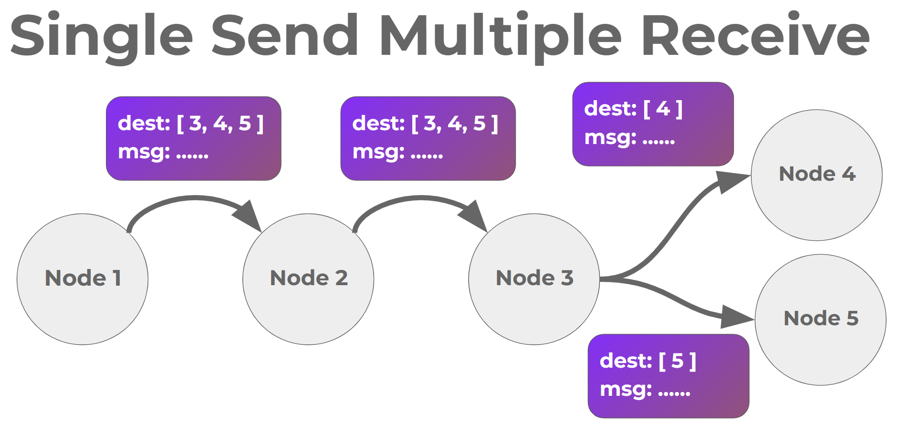

One of the key optimizations we implemented was Single Source Multiple Receive. We observed that during a bcast operation, the same message is sent to multiple workers. But since some messages are forwarded multiple times, the same message is sent multiple times. This is a waste of bandwidth.

Thus, we propose to change the destination of the message to hold multiple destinations. This way, when a message is sent, it is sent to multiple destinations at once. Each forwarder along the way will first check if the message is meant for them, and if it is, they will first consume the message before forwarding it. Finally, the forwarding router will check if the message needs to be send along multiple paths to reach all the intended destinations. If it does, it will group the recipients to achieve the minimum number of duplications.

This optimization is implemented at both the local level between the Node Routers and the global level between the Global Routers.
This optimization is particularly useful when the local interconnect is a ring or a tree, as well as the global level where the resources are more scarce.

### Local Allreduce Optimization

At the local level, we implemented an optimized allreduce operation using ring reduce. As described in lecture, strategy uses signficantly less bandwidth than the naive allreduce implementation. Particularly, when the interconnect is a ring, the allreduce operation fits perfectly into the ring structure. 

For the tree interconnect, we implemented a optimized version as well. In this case, each layer of the tree reduces at the same time, and the root node broadcasts the result to all the other nodes. This is a significant improvement over the naive allreduce implementation, which would have to send the message to every other node.

### Global Optimization

As described before, sending messages over the WebSocket server has high latency and low bandwidth. To reduce the number of messages sent, we implemented a divide-and-conquer strategy for MPI_Reduce and MPI_Barrier. For reduce, for example, first, each machine does its local fast reduce to produce a partial result. Then, the operation is raised to the global level, where each machine sends its partial result to perform a secondarily reduce. This way, the number of messages sent over the WebSocket server is reduced significantly.

### Latency Hiding

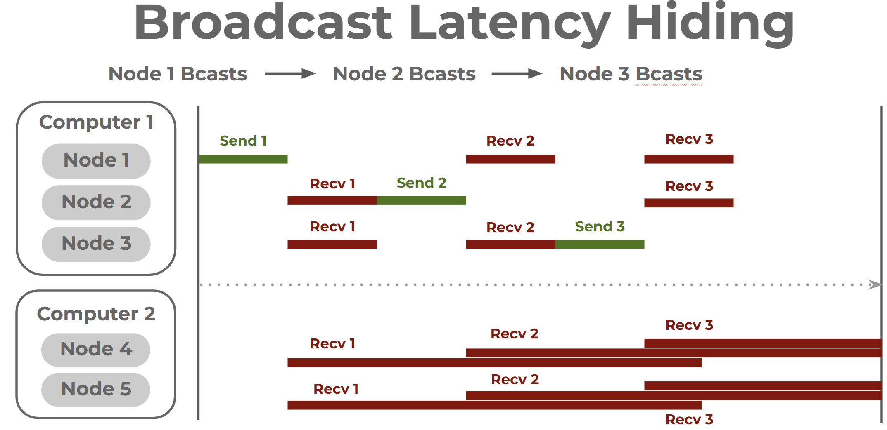

Finally, we implemented a latency hiding strategy for the bcast operation. We discovered that the WebSocket is many orders of magnitude slower than the local communication. Thus, we implemented a strategy where the local workers can keep working if permitted by correctness. This way, the latency of sending messages over the WebSocket server significantly overlaps. We found that the bandwidth isn't the bottleneck, so this strategy is particularly effective.

In this example, node 1 first sends a bcast to everyone, then node 2 sends a bcast to everyone. However, node 1's message reaches node 2 before node 1's bcast reaches everyone on the other machine. Instead of waiting for the message to propagate fully, node 2 can continue working and send its bcast without violating correctness. This way, the latency of the bcast operation is significantly reduced.

## RESULTS

<!-- RESULTS: How successful were you at achieving your goals? We expect results sections to
differ from project to project, but we expect your evaluation to be very thorough (your
project evaluation is a great way to demonstrate you understood topics from this course).
Here are a few ideas:
* If your project was optimizing an algorithm, please define how you measured perfor-
mance. Is it wall-clock time? Speedup? An application specific rate? (e.g., moves
per second, images/sec)
* Please also describe your experimental setup. What were the size of the inputs? How
were requests generated?
* Provide graphs of speedup or execute time. Please precisely define the configurations
being compared. Is your baseline single-threaded CPU code? It is an optimized
parallel implementation for a single CPU?
* Recall the importance of problem size. Is it important to report results for different
problem sizes for your project? Do different workloads exhibit different execution
behavior?
* IMPORTANT: What limited your speedup? Is it a lack of parallelism? (dependen-
cies) Communication or synchronization overhead? Data transfer (memory-bound or
bus transfer bound). Poor SIMD utilization due to divergence? As you try and an-
swer these questions, we strongly prefer that you provide data and measurements to
support your conclusions. If you are merely speculating, please state this explicitly.
Performing a solid analysis of your implementation is a good way to pick up credit
even if your optimization efforts did not yield the performance you were hoping for.
* Deeper analysis: Can you break execution time of your algorithm into a number
of distinct components. What percentage of time is spent in each region? Where is
there room to improve?
* Was your choice of machine target sound? (If you chose a GPU, would a CPU have
been a better choice? Or vice versa.) -->

### Local Tests

Due to limited space, we only show the speedup graphs here. For the full results, please see [https://github.com/the-parallel-gods/mpi.js/tree/main/docs/images/benchmarks](https://github.com/the-parallel-gods/mpi.js/tree/main/docs/images/benchmarks).

In the following tests, we run the MPI operations on a single browser with multiple workers. The speedup is calculated by comparing the time taken for the unoptimized version and the optimized version. The optimized version has the SSMR and the local allreduce optimization, while the unoptimized version does not.

#### Allreduce

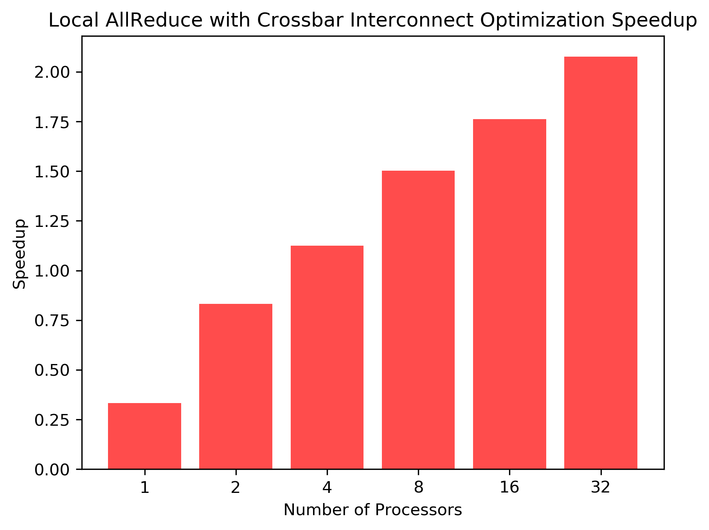{: style="display:block;width:75%;margin-left: auto;margin-right: auto;"}

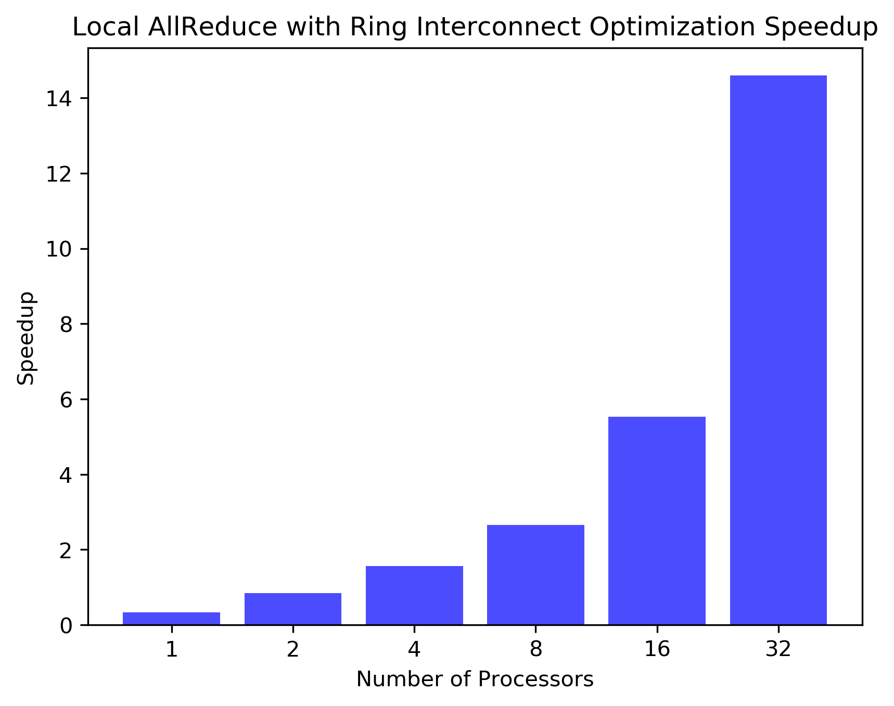{: style="display:block;width:75%;margin-left: auto;margin-right: auto;"}

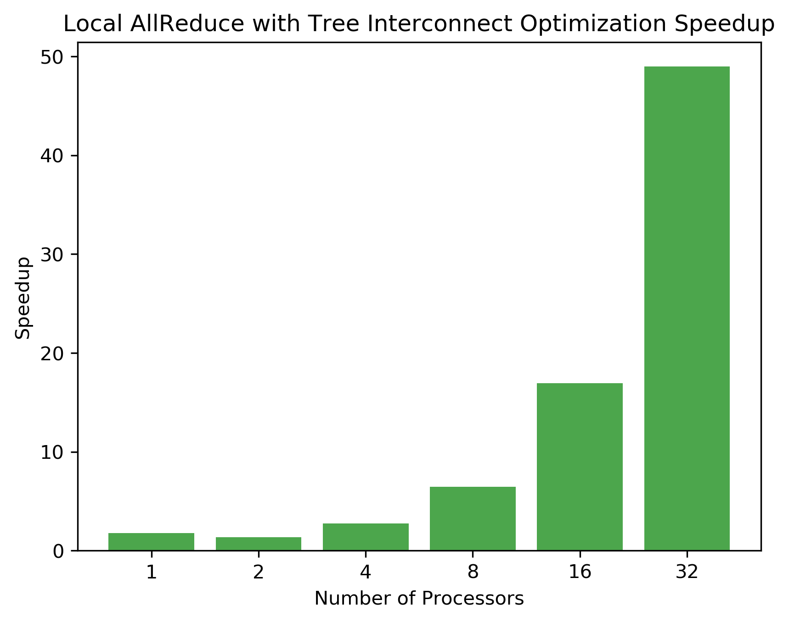{: style="display:block;width:75%;margin-left: auto;margin-right: auto;"}

When using the crossbar interconnect, communication is relatively fast. Because of this, naively sending the message to all other nodes is slightly faster than doing the ring reduce when the number of nodes is small. As a result, the extra overhead of calculating indices in ring reduce actually 3x slower. However, as the number of nodes increases, the ring reduce becomes steadily faster than the naive reduce. The fastest speedup is 2x with 32 nodes.

When using the ring interconnect, the ring reduce is also slower than the naive reduce when the number of nodes is small. Again, this signifies the significant overhead of ring reduce. However, as the number of nodes increases, the ring reduce becomes significantly faster than the naive reduce. The fastest speedup is 14x with 32 nodes. Note that the ring reduce has higher speedup than the crossbar because when the interconnect gets more congested, the crossbar architecture is more efficient than the ring architecture, since it does not involve any message forwarding.

When using the tree interconnect, the tree reduce is around the same speed as the naive reduce when the number of nodes is small. However, as the number of nodes increases, the tree reduce sees the largest speedup. The fastest speedup is 50x with 32 nodes. While the optimized version perfectly fits the tree achitecture's structure, the naive version has to send the message to every other node. Because the tree has a root, which is a single point of contention, the unoptimized version which doesn't know about this contention is extremely slow. Due to this contention, the tree architecture is the slowest when using the naive reduce.

#### Barrier

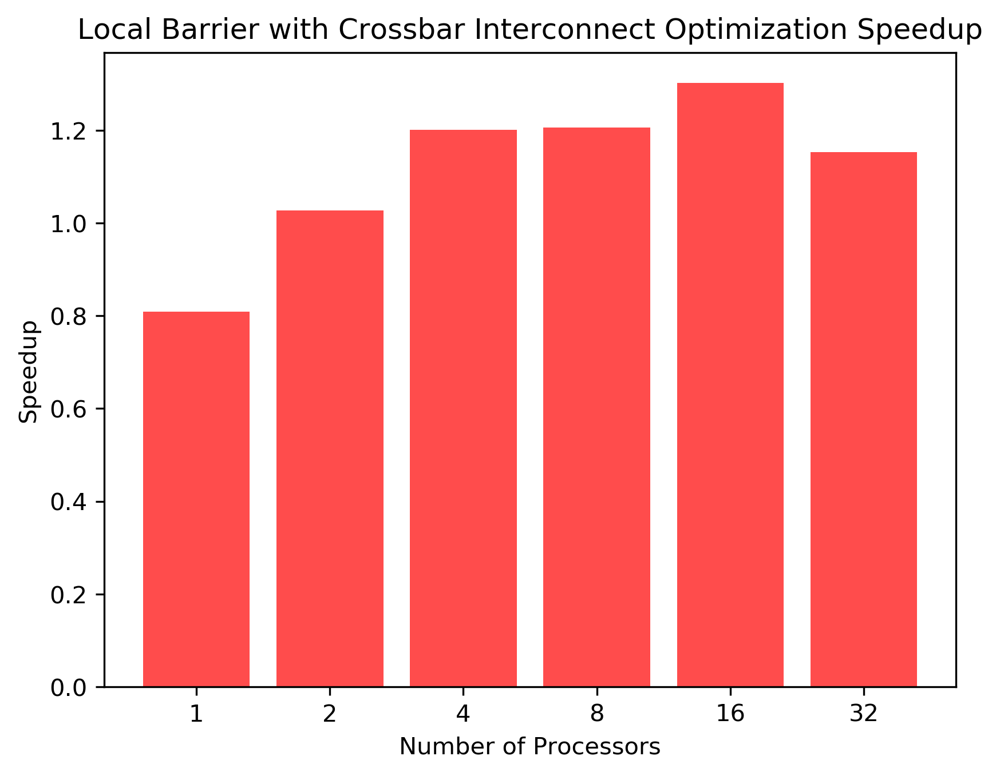{: style="display:block;width:75%;margin-left: auto;margin-right: auto;"}

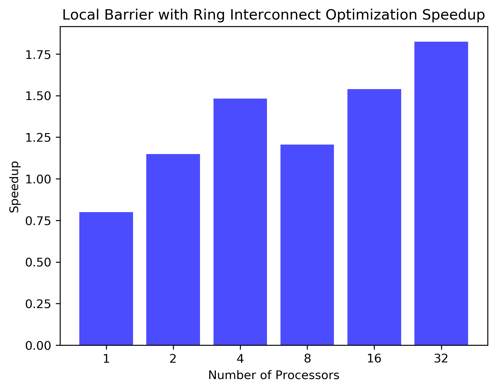{: style="display:block;width:75%;margin-left: auto;margin-right: auto;"}

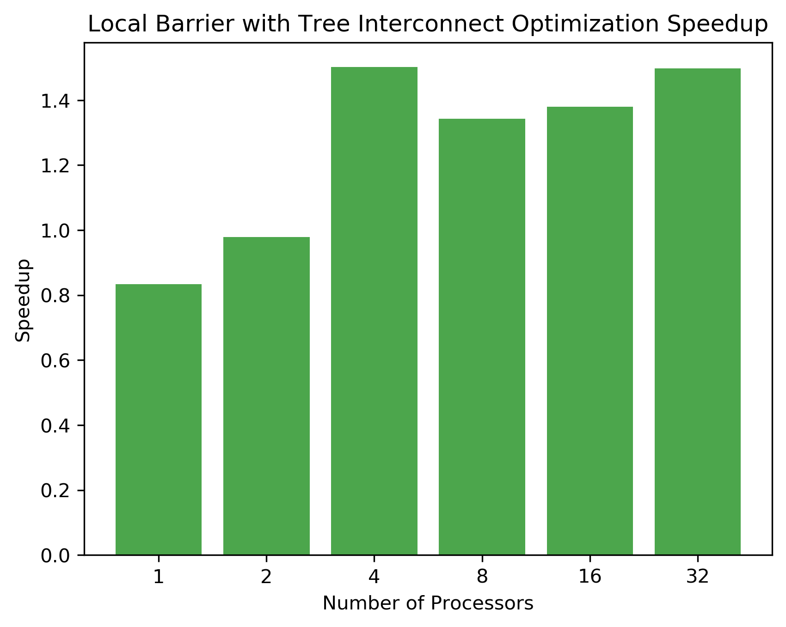{: style="display:block;width:75%;margin-left: auto;margin-right: auto;"}

In this test, we see that the optimized barrier operation is not significantly different in speed on the crossbar architecture. This is 

#### Bcast


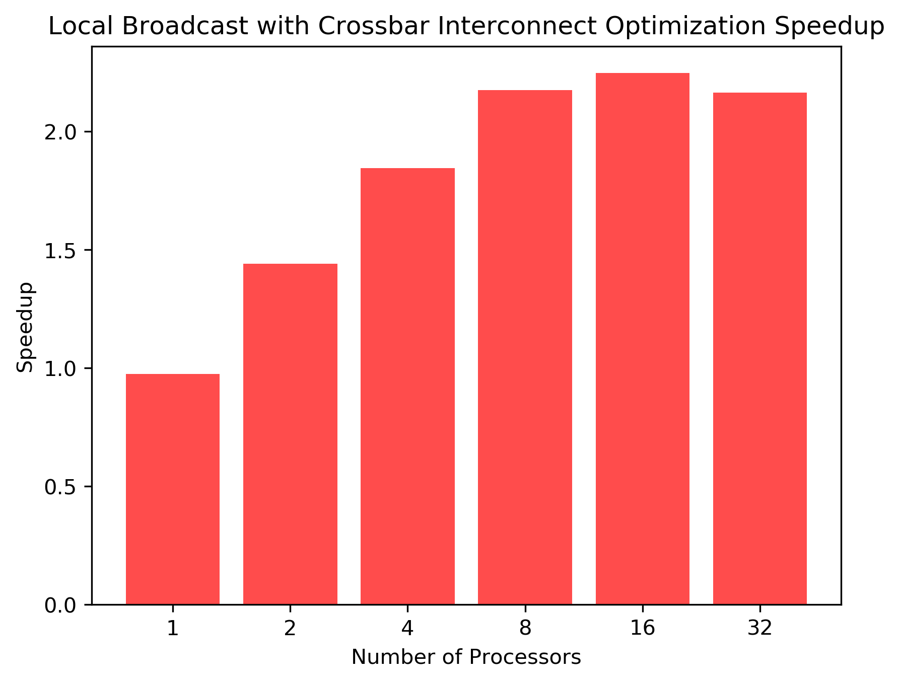{: style="display:block;width:75%;margin-left: auto;margin-right: auto;"}

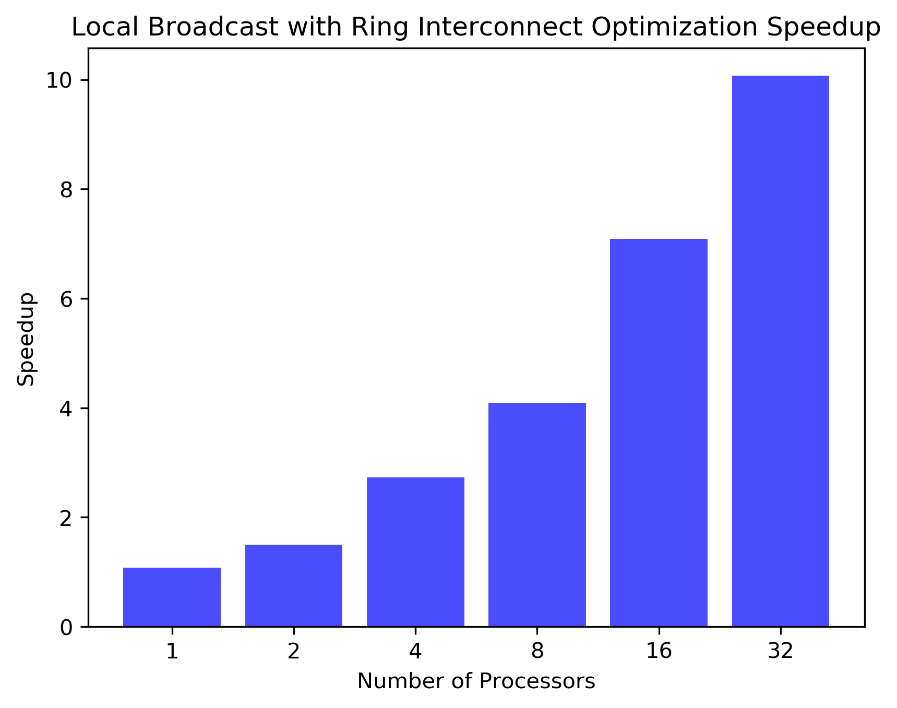{: style="display:block;width:75%;margin-left: auto;margin-right: auto;"}

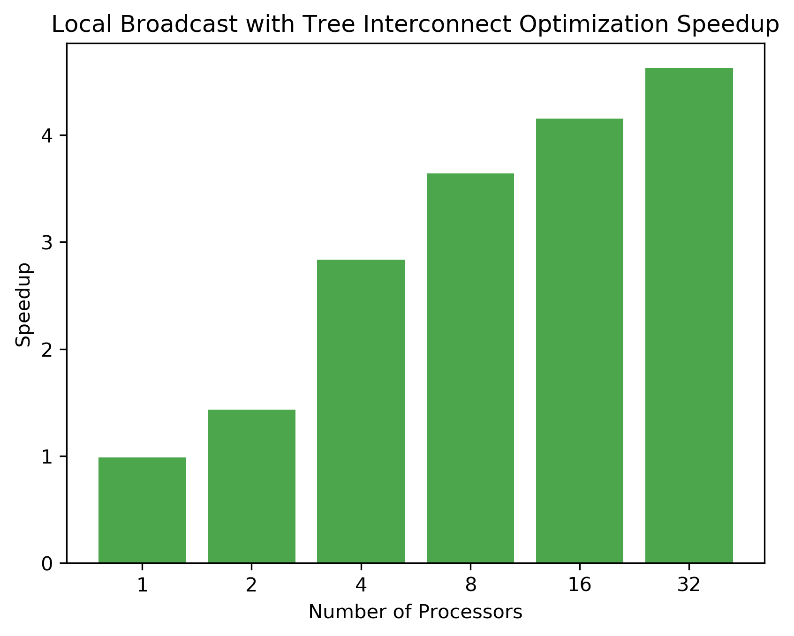{: style="display:block;width:75%;margin-left: auto;margin-right: auto;"}

### Global Tests

#### Broadcast

_Global_Unoptimized_Broadcast_Time.png){: style="display:block;width:75%;margin-left: auto;margin-right: auto;"}


_Global_Optimized_Broadcast_Time.png){: style="display:block;width:75%;margin-left: auto;margin-right: auto;"}

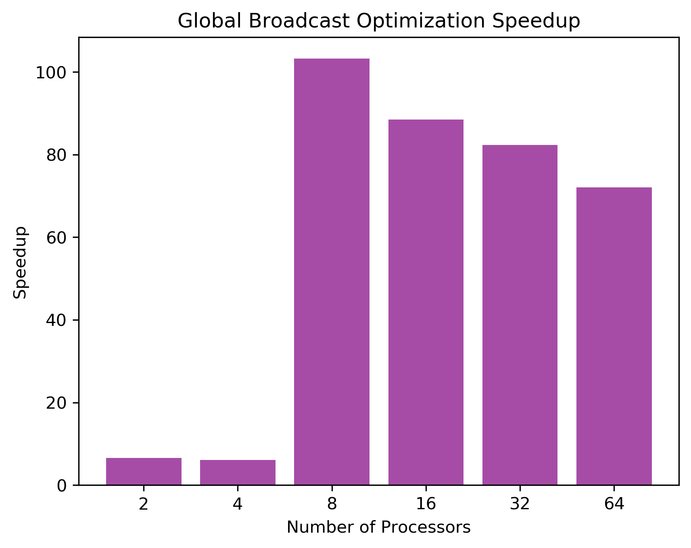{: style="display:block;width:75%;margin-left: auto;margin-right: auto;"}


#### Reduce

_Global_Unoptimized_Reduce_Time.png){: style="display:block;width:75%;margin-left: auto;margin-right: auto;"}


_Global_Optimized_Reduce_Time.png){: style="display:block;width:75%;margin-left: auto;margin-right: auto;"}
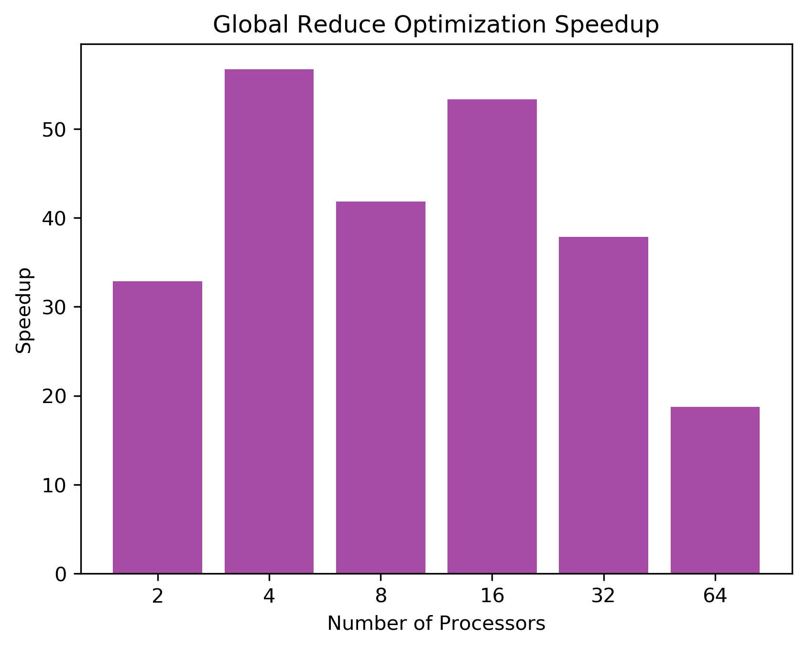{: style="display:block;width:75%;margin-left: auto;margin-right: auto;"}


### Barrier

_Global_Unoptimized_Barrier_Time.png){: style="display:block;width:75%;margin-left: auto;margin-right: auto;"}


_Global_Optimized_Barrier_Time.png){: style="display:block;width:75%;margin-left: auto;margin-right: auto;"}

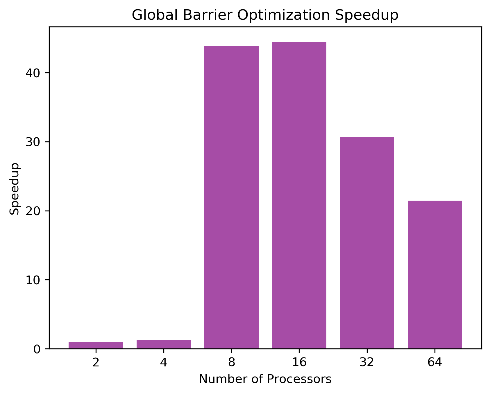{: style="display:block;width:75%;margin-left: auto;margin-right: auto;"}


## Conclusion

This project is much larger and more complex than we initially anticipated. We learned a lot not only about MPI, but also about the browser environment, identifying relevant bottlenecks, and optimizing for interconnects. In the end, this project has over 3000 lines of code, including the library and documentation. 
Although we could not implement the non-blocking APIs (due to the single-threaded nature of JS), we spent the time to optimize the collective APIs instead. We are proud of the results we achieved, 

## Contribution

### Sean (haoxians) - 50%


* [x] MPI front end

[Sean](https://github.com/SeanSun6814)


### David (drudo) - 50%

* [x] MPI backend end

[David](https://github.com/1CoolDavid)
