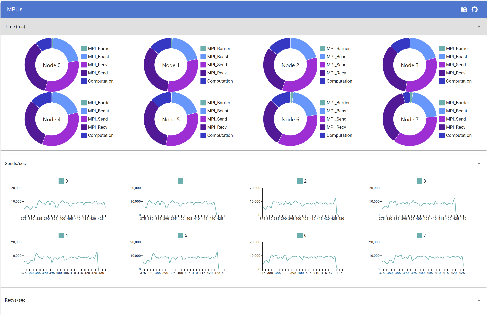

## PROJECT: MPI.JS -- Milestone Report

## **URL**

[https://the-parallel-gods.gitbook.io/mpi](https://the-parallel-gods.gitbook.io/mpi)

## BACKGROUND & PLATFORM CHOICE

> Atwood’s Law: “Any application that can be written in JavaScript, will eventually be written in JavaScript.”

JavaScript is one of the most popular languages used by many developers. It also runs across diverse platforms. To make MPI accessible to more programmers and compatible with more devices, we introduce it to JavaScript.

As described in [#the-challenge](proposal.md#the-challenge "mention"), JS is an inherently single-threaded programming language. Thus, shared-memory parallel models similar to OpenMP are simply not possible. However, we can still pass messages between multiple "isolated threads" in JS. In such an environment, MPI becomes the perfect solution for parallel programming.

## Summary On Progress

We made huge progress on the project. 

The first big challenge was to make a transpiler that can convert user code into runnable MPI.js code. This involved writing a full stack server, with front-end code that can create the web workers and link with the UI, the backend code to dynamically route the user MPI code, and hot load it into the web workers, and finally the web workers themselves that receives all the system configurations and channel information. The scope of this was way beyond what we initially dreamed of, but after long hours, it's a miracle that it works.

We then created the `node_router` which magically queues up messages by other nodes and feeds them to callbacks, supporting message tags. We optimized this data structure for 4 iterations, and finally optimized it to be O(1) time for all operations. After this, we implemented some basic send and receive MPI functions, and tested them with the transpiler. With much work-around (as described below), we also hacked together a way to support async sends and receives in a single-threaded language.

After that, we developed a low-overhead, automatic diagnostic collection system that can be used to monitor the performance of various functions in the MPI.js system. This data is then live-streamed to a real-time dashboard that shows the number of messages being sent and received per second, as well as the time spent in each function vs the time spent on actual computation. Along with this, we developed a simple to use SmartDashboard that allows users to draw graphs, charts, progress bars, and logs in real-time, to help them debug their code.

Then, we implemented the `sqrt` MPI program (from the asst4 example) and found that our JavaScript system is able to perform 5x-10x slower than pure `-O3` heavily optimized C code, which is a huge win. Our benchmark also shows that our system can handle up to 100,000+ message sends and receives per second.

Finally, we made [a very detailed documentation](docs.md) for every single class, every single data type, and every single function in our system. This will greatly help users to program using our library.

## Current Project Status

* [x] **Make a nice documentation website**
* [ ] **Implement the following APIs**
  * [ ] Basics
    * [x] MPI\_Init
    * [x] MPI\_Finalize
    * [ ] MPI\_Abort
    * [x] MPI\_Comm\_size
    * [x] MPI\_Comm\_rank
  * [x] P2P
    * [x] MPI\_Send
    * [x] MPI\_Isend
    * [x] MPI\_Recv
    * [x] MPI\_Irecv
  * [ ] Barriers & Broadcasts
    * [x] MPI\_Barrier
    * [ ] MPI\_Ibarrier
    * [x] MPI\_Bcast
    * [ ] MPI\_Ibcast
  * [ ] Gathers
    * [ ] MPI\_Gather
    * [ ] MPI\_Gatherv
    * [ ] MPI\_Igather
    * [ ] MPI\_Igatherv
    * [ ] MPI\_Allgather
    * [ ] MPI\_Allgatherv
    * [ ] MPI\_Iallgather
  * [ ] Scatters
    * [ ] MPI\_Scatter
    * [ ] MPI\_Scatterv
    * [ ] MPI\_Iscatter
    * [ ] MPI\_Iscatterv
  * [ ] Reduces
    * [ ] MPI\_Reduce
    * [ ] MPI\_Ireduce
    * [ ] MPI\_Allreduce
    * [ ] MPI\_Iallreduce
* [x] **Write the tool that transplants user JS code into runnable MPI.js code**
* [ ] **Compare different communication methods (channels/WebSockets) between local threads**
* [x] **Use WebSockets to connect MPI nodes across multiple computers**
* [ ] **Optimize for memory usage by using clever message-routing techniques**
* [ ] **Run benchmarks on all variations of our API**

## HOPE TO ACHIEVE

* [x] **Make a live dashboard that shows how many msgs/sec are happening in real-time**
* [ ] **<strike>Make a debugging dashboard that replays the communications during computation~~</strike>**
* [ ] **Implement the following APIs**
  * [ ] MPI\_Scan
  * [ ] MPI\_Exscan

## Goals Being Removed

After considering our progress and discoveries made while working on mpi.js, we've decided to no longer pursue the idea of a "debugging" dashboard. The amount of memory necessary to hold the timeline information necessary to implement such a dashboard is too large to be feasibly completed without detracting from the original project. Since we still need to work on the different routing strategies for reduce, gather, and scatter it is also more likely that we will not have time to implement scan since we want to dedicate time to have interesting data to compare. 

We also dropped "fast" support for async MPI functions (we will keep the slow version). This is because JavaScript is a single-threaded event-driven language, meaning any function when started cannot be interrupted. Thus, when the user code is running, messages cannot be received. While we found a way around it (by explicitly descheduling the user code, and delegating the server to re-trigger a new event for the remainder of the user code to be resumed after any messages are checked for), it is incredibly complex and inefficient. We decided that the speed of this cannot be improved due to the nature of JavaScript. Thus, while all async function calls will behave correctly and be supported, they are highly discouraged.

## Issues that Concern Us

Not much. In the proposal feedback, we are recommended to perform more performance analysis and comparison. We plan to do this in architectural optimizations. Since in our system, local communications are fast and global communications are slow between machines, we wish to implement and benchmark several versions of the reduce function. Specifically, we want to use ring reduce locally first, and then tree reduce between the machines. 

We also wish to explore the possibility of workers not being fully connected by channels within a machine, and the routing optimizations that we can perform in that system hierarchy. Finally, we will run the baseline of having websockets connect every worker (in the worst case scenario) and compare it to the optimized versions.

Suggestions on any other ideas for performance optimizations and comparisons that can be done is welcome and appreciated.

## Intentions For Poster Session

Our intention is to use our in-development dashboard as our main presentation tool. Since it shows a break down of time a process spends sending, receiving, waiting, and actually computing it's a great way to visually show the relative speed up we are providing to a program. We also plan to show some pre-captured measurements from the dashboard so that the demo doesn't have to manually run through every variation of our mpi configurations we want to analyze.

## Updated SCHEDULE

| Date                 | Sean                                  | David                                     |
| -------------------- | ------------------------------------- | ----------------------------------------- |
| 3/28                 | Submit Proposal                       | Submit Proposal                           |
| 4/10                 | Set up P2P                            | Set up Basics API                         |
| 4/11                 | Finish JS transplanter                | Set up route forwarding data              |
| 4/13                 | Live Dashboard                        | Set up Websocket support with current API |
| 4/17 (By Checkpoint) | Set up routing local protocol options | Set up global protocol options            |
| 4/24                 | Gather, Scatter                       | Reduce/Broadcast                          |
| 5/3                  | Set up local results downloader       |                                           |
| 5/4                  | Submit Report                         | Submit Report                             |
| 5/6                  | Demo Day                              | Demo Day                                  |

## ABOUT US

### Sean (haoxians)

[Sean](https://github.com/SeanSun6814)

### David (drudo)

[David](https://github.com/1CoolDavid)